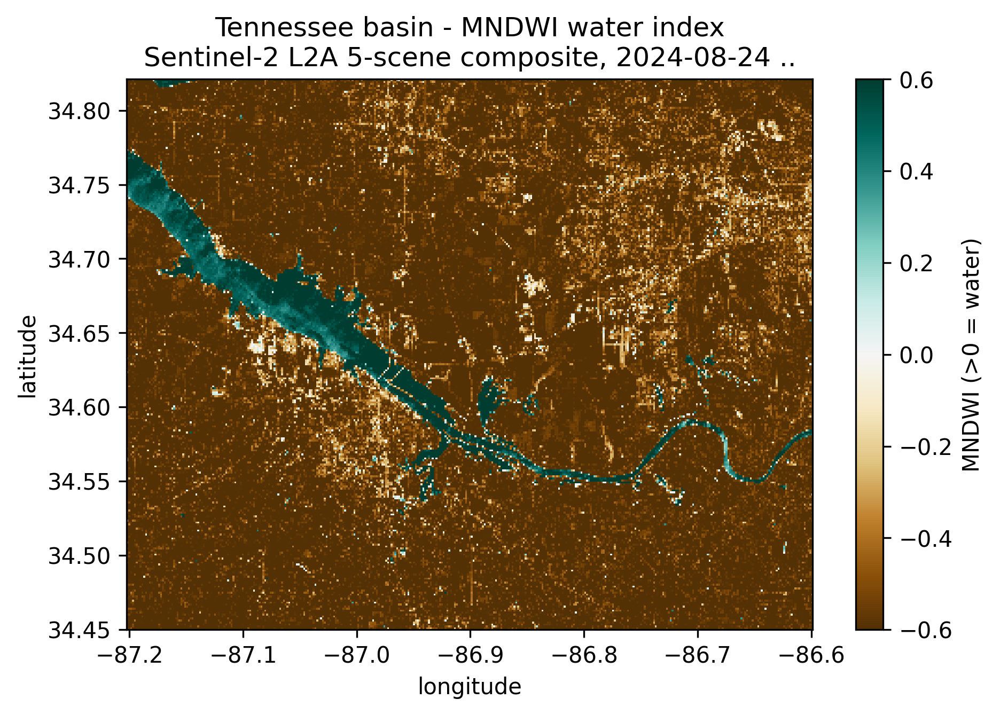
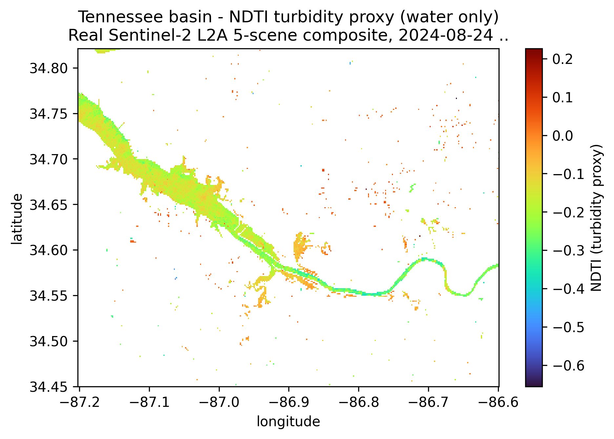
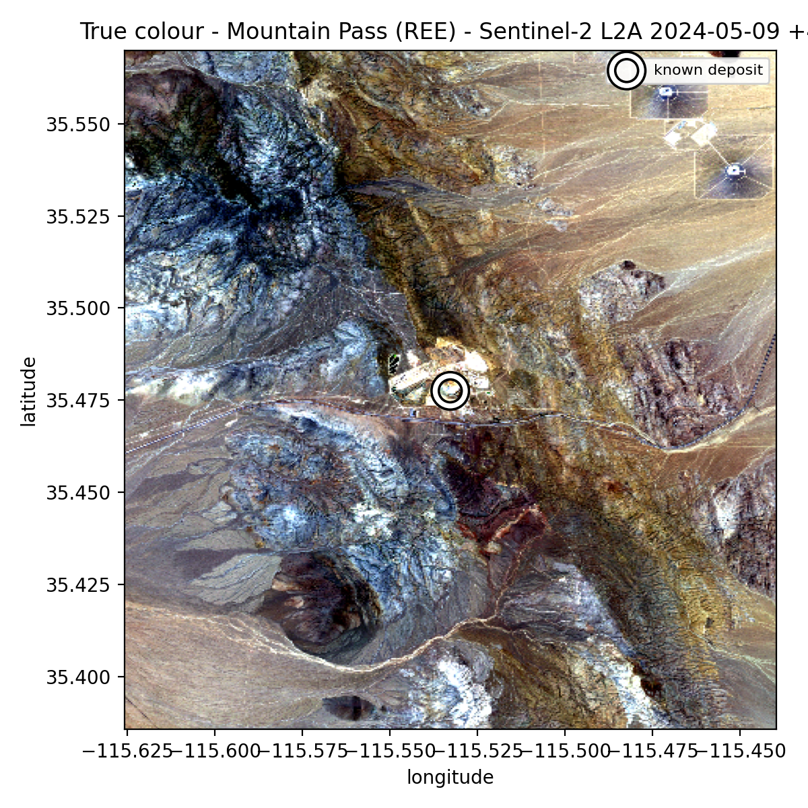
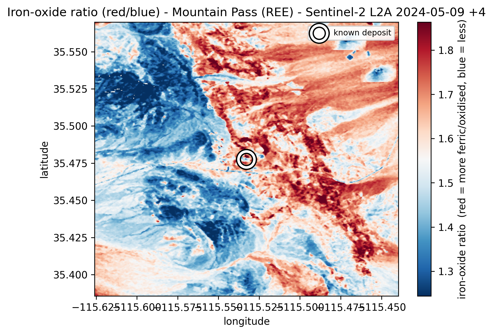
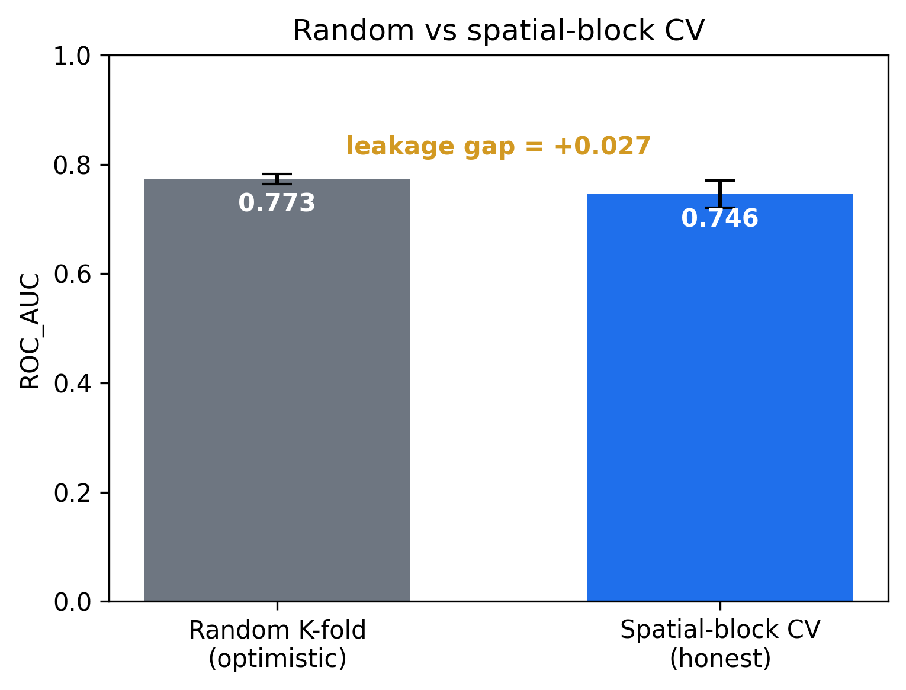
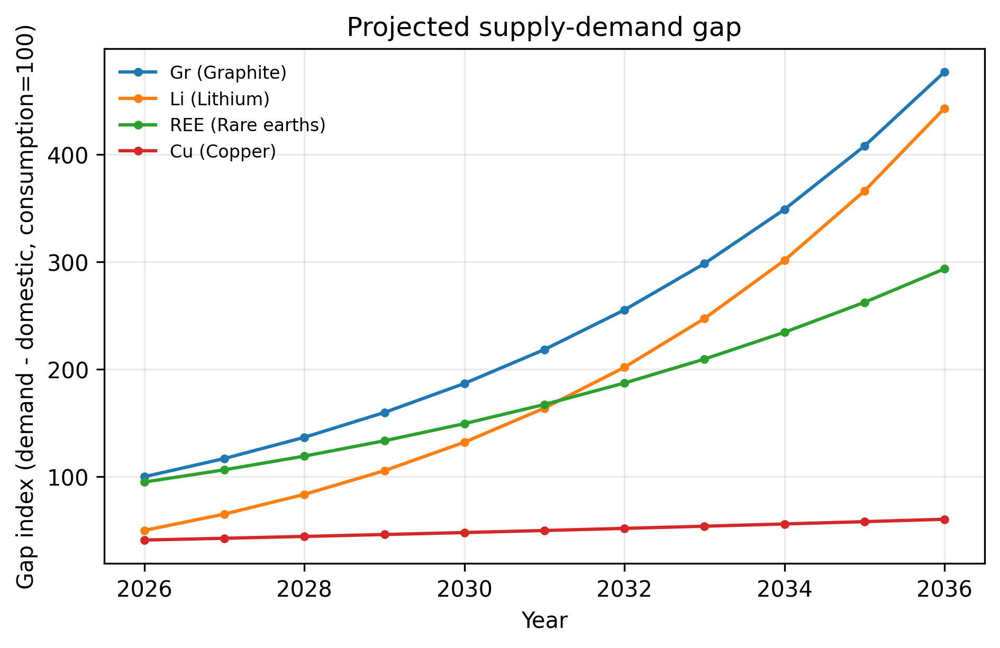

# STRATA: Strategic Terrain & Resource Analytics

A cross-sector geospatial-ML platform that carries the **SHAD-RD engine** (the
framework from Dr. Stefani Yates's Doctor of Computer Science dissertation: HLS
v2.0 + Prithvi-EO-2.0-300M + LightGBM + spatially-blocked cross-validation,
originally for satellite water-quality turbidity regression) into three
resource- and energy-security domains:

| Sector | What it does | Output |
| --- | --- | --- |
| **Minerals** | Prospectivity ("best locales") + footprint monitoring of critical-mineral sites | Ranked new target coordinates; expansion flags; honest spatial-CV skill |
| **Supply** | Supply-demand gap scenarios for critical minerals | Strategic shortfall ranking resolved to **specific sites** |
| **Energy** | Multi-criteria siting for clean firm power (SMR / geothermal) | Ranked siting **coordinates**, tied to mineral demand |

The point of the platform is that **one engine drives all three sectors**: the
cross-domain transferability claim, made concrete and runnable, and a natural
seam for follow-on publications.

---

## Real results

One engine and one connector, run on **real Sentinel-2 L2A** imagery across two
domains and three sites, with no engine changes between them.

**Tennessee basin (water-quality domain).** The engine's MNDWI water mask
delineates the Tennessee River / Wheeler Lake, and the NDTI turbidity proxy
varies across the reservoir.




**Mountain Pass, CA (REE) and Thacker Pass, NV (Li), the mineral domain.** The
same connector pulls real reflectance over each district; the engine's mineral
feature stack separates the known mine footprint from background at AUC 0.97
(Mountain Pass) and 0.92 (Thacker Pass). Iron-oxide ratio is shown red (ferric)
to blue (less ferric); the white ring is the known deposit.




**Spatial-leakage discipline and supply-demand gap (offline demonstration substrate).**
Random versus spatial-block CV surfaces the leakage gap; the gap model ranks
strategic shortfalls and resolves them to specific sites.




> Figures over the synthetic substrate are clearly labelled as demonstrations;
> the Sentinel-2 results above are real. See the honesty contract below.

---

## The honesty contract (read this first)

STRATA runs **100% offline** with **zero credentials and no GPU** by using a
clearly-labelled **synthetic reflectance substrate**. Synthetic inputs exist to
exercise every code path deterministically; they are **never** reported as real
predictions, and every surface (console, app, figures) says so.

To produce **real** results, two paths exist, both wired in:

- `shadrd.SentinelL2AConnector` is **credential-free** and already validated. It
  reads real Sentinel-2 L2A surface reflectance from AWS Open Data via the
  Element84 STAC (no Earthdata token). This is the path used by `run_tn_basin.py`.
- `shadrd.HLSConnector.load_reflectance(...)` reads real HLS v2.0 via NASA
  CMR-STAC (needs your Earthdata token).

Plus the other real sources, each stubbed with actionable errors:
- `shadrd.features.prithvi_embeddings(...)` for Prithvi-EO-2.0-300M via terratorch
- `minerals.catalog.mrds_connector(csv)` for the full USGS MRDS inventory
- `supply.load_commodities(csv)` for current USGS Mineral Commodity Summaries
- `supply.eia_connector(series_id, key)` for live EIA API v2 demand drivers

Nothing downstream changes when you swap the data source. That is the design.

### Real-data run, Tennessee basin (validated)

`run_tn_basin.py` runs the engine's real imagery path over the Tennessee River /
Wheeler Lake reach near Huntsville (the dissertation study area):

```bash
python run_tn_basin.py
# on a TLS-intercepting network (corporate proxy / sandbox) first:
#   export STRATA_RELAX_SSL=1
```

A confirmed run pulled a 5-scene, cloud-masked Sentinel-2 L2A median composite
(Aug to Oct 2024), yielding ~101k cloud-free pixels at 150 m; the engine's MNDWI
water mask delineated the reservoir and river (~6% of the scene) and the NDTI
turbidity proxy over water averaged about -0.16 (relatively clear, as expected).
Outputs: `tn_water_mndwi.png`, `tn_turbidity_proxy.png`, `tn_basin_map.html`,
`tn_reflectance_indices.csv`, `tn_run_meta.json`. This validates the real
feature pipeline; turbidity *prediction* requires the dissertation's in-situ NTU
labels as the regression target.

### Real-data run, trained turbidity model

`run_shadrd_realdata.py` takes the co-located in-situ + HLS table (one row per
station and date, with the six HLS bands and the measured turbidity) and trains
the SHAD-RD turbidity model through the engine: water-domain indices plus colour
ratios and a day-of-year seasonal term, a LightGBM regressor on log turbidity,
and both a random holdout and a station-grouped spatial cross-validation. It
reproduces the central finding directly: a random split looks predictive while
the station-grouped SBCV collapses toward zero, because repeated readings at one
gauge leak between train and test. The run is CPU-only; the Prithvi-EO-2.0-300M
embedding features are added on the CUDA workstation via
`features.assemble(..., prithvi=True)`.

```bash
python run_shadrd_realdata.py --data data/hls_spectral_v10.csv
```

A companion script, `run_waterquality_profile.py`, characterises the two basins
across the in-situ parameters monitored for both (pH, dissolved oxygen,
specific conductance, turbidity) with robust descriptives and Cliff's-delta
effect sizes, as a water-quality signature rather than as model features.

---

## Quickstart

```bash
pip install -r requirements.txt

# 1) prove it works end-to-end (writes figures, maps, CSVs to outputs/)
python demo.py

# 2) launch the interactive tool
streamlit run app/streamlit_app.py

# 3) run the test suite
pytest -q
```

`demo.py` produces, in `outputs/`:
`leakage_minerals.png`, `supply_demand_gap.png`, `footprint_monitoring.png`,
`minerals_map.html`, `siting_map.html`, and the ranked-result CSVs
(`prospective_targets.csv`, `shortfall_ranking.csv`, `priority_sites.csv`,
`siting_sites.csv`).

---

## Why this is a project, not a repo

- **It runs cover-to-cover** offline (`python demo.py`) and the **tests pass**
  (`pytest -q`, 15 tests over the engine and all three sectors).
- **It ships a usable tool** (`streamlit run ...`) with scenario controls and
  maps.
- **Every output is a specific place or a defensible number**, not a vague
  score.
- **The data honesty is explicit**, matching a research-grade accuracy standard.

---

## Structure

```
strata/
  shadrd/          SHAD-RD engine (sector-agnostic core)
    indices.py       spectral index library (water / mineral / disturbance)
    spatial_cv.py    spatially-blocked CV + leakage_report
    model.py         LightGBM wrapper with honest spatial-CV evaluation
    features.py      reflectance to (feature matrix, names); Prithvi hook
    imagery.py       HLS connector (real) + synthetic substrate (offline)
  sectors/
    minerals/        catalog (16 real sites), prospectivity, monitoring
    supply/          commodity reference data, gap scenarios, site linkage
    energy/          multi-criteria clean-firm-power siting
  viz/             folium maps + matplotlib (paper-ready) figures
app/streamlit_app.py   the shippable 3-tab console
demo.py                headless end-to-end runner
tests/                 pytest suite
METHODS.md             publication-oriented methods note
```

See `METHODS.md` for the methodology and the publication hooks.
